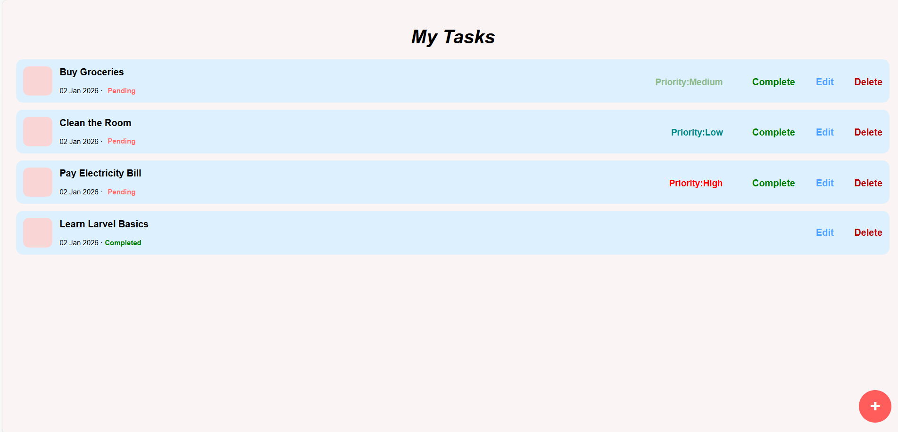
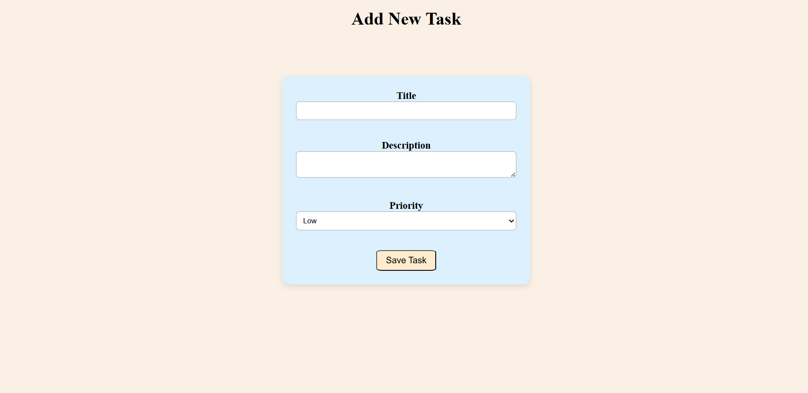
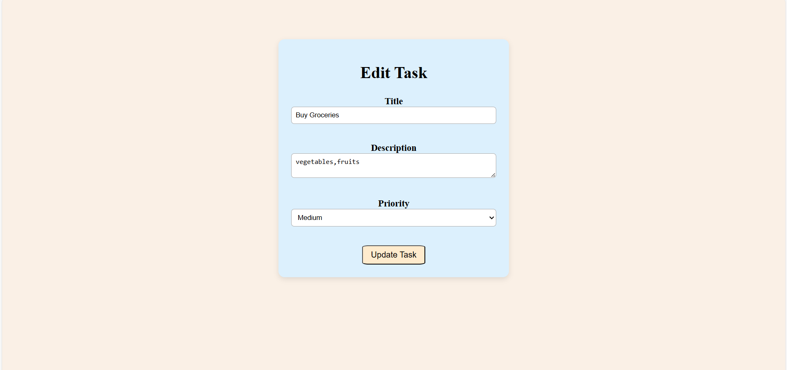

# Task Management System (Laravel)

## Project Description
A simple single-user Task Management System built using Laravel.This application allows users to create,view, update, delete, and mark tasks as completed.Each task has a priority level(Low,Medium,High) and a status (Pending or completed).

## Features
- Create new tasks
- Edit existing tasks
- Delete tasks
- Mark tasks as completed
- Priority management (Low / Medium / High)
- Clean and user-friendly interface

## Technology Stack
- PHP 8.2.12
- Laravel 12.44.0
- MySQL
- HTML, CSS

## Setup Instructions
1. Clone the repository:
    git clone https://github.com/Shravya234/task-manager.git

2. Navigate to the project directory:
    cd task-manager

3. Install dependencies:
    composer install
 
4. Create environment file:
    copy .env.example to .env

5. Update database details in .env file(laravel to task_manager):
    DB_DATABASE=task_manager 

    DB_USERNAME=root

    DB_PASSWORD=

7. Generate application key:
    php artisan key:generate

8. Run migrations:
    php artisan migrate

9. Start the server:
    php artisan serve

10. Open browser and visit:
    http://127.0.0.1:8000

## Screenshots
### Task List Page

### Add Task Page

### Edit Task Page

## Author
Shravya
